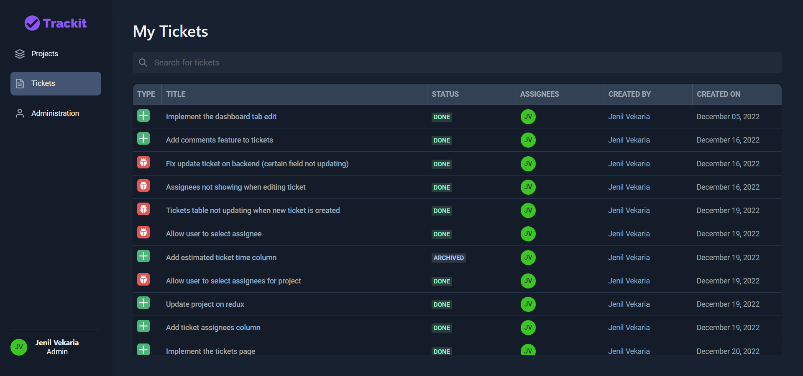
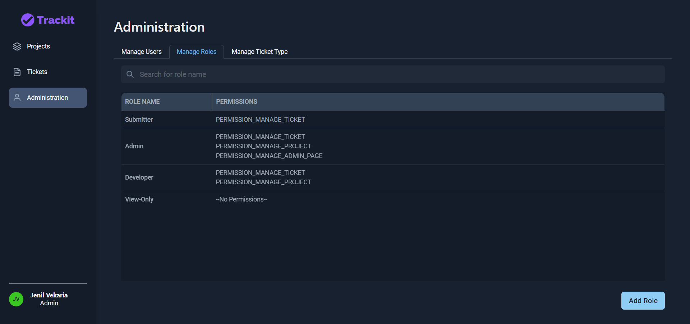

<!-- INTRO SECTION -->
 

  

  <h3 align="center">Issue and Project Tracking System</h3>

  

    Use Trackit! Tracking system that allows team members to collaborate, discuss and manage projects effectively 
     
     
  

<!-- FEATURE SECTION -->

## ✨ Features

- Team management
- Project management
- Ticket management
- User assignment
- Search
- Statistics
- Comments
- Role based organization (Create custom permissions)
- Ticket Type field (Create custom ticket type)
- Attachments (TODO)
- Change tracker (TODO)

<!-- TECHNOLOGY SECTION -->

## 🛠️Technologies

| **Front-end** | 
  React
                                                                                        | 
 Chakra UI
                                                                | 
 Axios
                                                          | 
 Redux
      |
| ------------- | ------------------------------------------------------------------------------------------------------------------------------------------------------------------------------------------------------------------- | ---------------------------------------------------------------------------------------------------------------------------------------------------------------------------------------------------- | ---------------------------------------------------------------------------------------------------------------------------------------------------------------------- | ------------------------------------------------------------------------------------------------------------------------------------------------ |
| **Back-end**  | 
 NodeJs
 | 
 ExpressJS
 | 
 MongoDB
 | 
 Jest
 |

## 📸 Screenshots

#### TODO: Descriptions to be added

  <h3>Login</h3>
  

  <h3>View All Projects</h3>
  

  <h3>Add Project</h3>
  

  <h3>Add Project (Contributor)</h3>
  

  <h3>View Project Info</h3>
  

  <h3>Project Overview</h3>
  

  <h3>View Ticket Info</h3>
  

  <h3>My Tickets</h3>
  

  <h3>Admin - Manage Users</h3>
  

  <h3>Admin - Manage Roles</h3>
  

  <h3>Admin - Manage Roles (Add)</h3>
  

  <h3>Admin - Manage Ticket Types</h3>
  

  <h3>Admin - Manage Ticket Types (Add)</h3>
  

